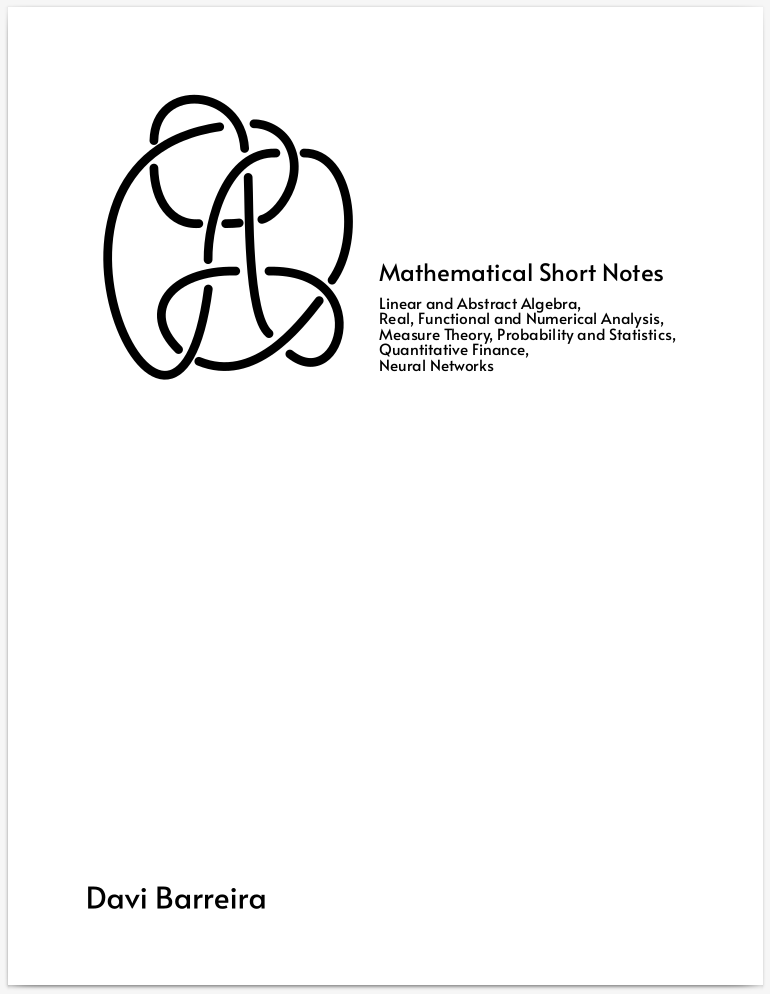

#  Mathematical Short Notes
### :notebook: A collection of notes on a variety of Mathematical topics.

This repo is a collection of notes based on the courses I've been taking during
my masters and now my PhD, at FGV School of Applied Mathematics [EMAp](https://emap.fgv.br/).

I just started writing this recently, and I intend
to keep updating it as I study and revise subjects.
Some of the notes are in hand-written form, and I intend to
transcribe them to LaTeX. But this might take some time.

Some subjects are naturally programming oriented
and I intend to provide some code in Julia, which I find ideal
for mathematical modelling.

<!-- The most current version of the notes are in the -->
<!-- [*Mathematical Short Notes* book](https://github.com/davibarreira/Mathematical-Short-Notes/blob/master/Book/main.pdf). -->

<center>
<a href="https://github.com/davibarreira/Mathematical-Short-Notes/blob/master/Book/main.pdf">

</a>
</center>


## :file_folder: Content of the Repository
Here is a summary of what is in this repository (note that this
is not static, and I'll update as I write more stuff).

Each note uses different books are references, but I'll put here the main reference for each,
unless the note is really a mixture of things.

The percentage is related to how much I have written compared to what I still intend on writing about the subject,
and **not** how much of the subject is covered.

When appropriate, I'll try to write some Julia code inside each subject.

-  - Category Theory;
-  - Convergence Spaces and Point-Set Topology;
-  - Real Analysis;
-  - Linear Algebra;
-  - Measure Theory;
-  - Functional Analysis;
-  - Probability;
-  - Ordinary Differential Equations;
-  - Mathematical Statistics;
-  - Machine Learning;
-  - Neural Networks;
-  - Quantitative Finance and Stochastic Calculus;
-  - Inequalities Galore;
-  - Fourier Transform;


## Citing

For citation, you can use the bibtex:
```
@misc{2021msn,
  author = {Davi Sales Barreira},
  title = {Mathematical Short Notes},
  howpublished = "\url{http://https://github.com/davibarreira/Mathematical-Short-Notes}",
  year = {2021}, 
}
```

## LICENSE

These notes are licensed under [Creative Commons Attribution-NonCommercial-ShareAlike 4.0 International][cc-by-nc-sa].

## PS

If you read Portuguese and is starting an undergraduate's course on Mathematics,
check out [this repo by @wellington36](https://github.com/wellington36/Resumos_EMAP-FGV).


[![CC BY-SA 4.0][cc-by-nc-sa-image]][cc-by-nc-sa]

[cc-by-nc-sa]: http://creativecommons.org/licenses/by-nc-sa/4.0/
[cc-by-nc-sa-image]: https://licensebuttons.net/l/by-nc-sa/4.0/88x31.png
[cc-by-nc-sa-shield]: https://img.shields.io/badge/License-CC%20BY--NC--SA%204.0-lightgrey.svg
